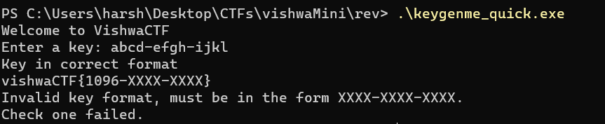
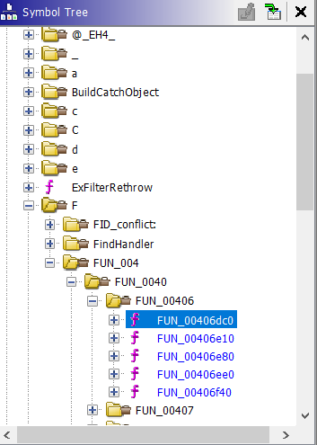
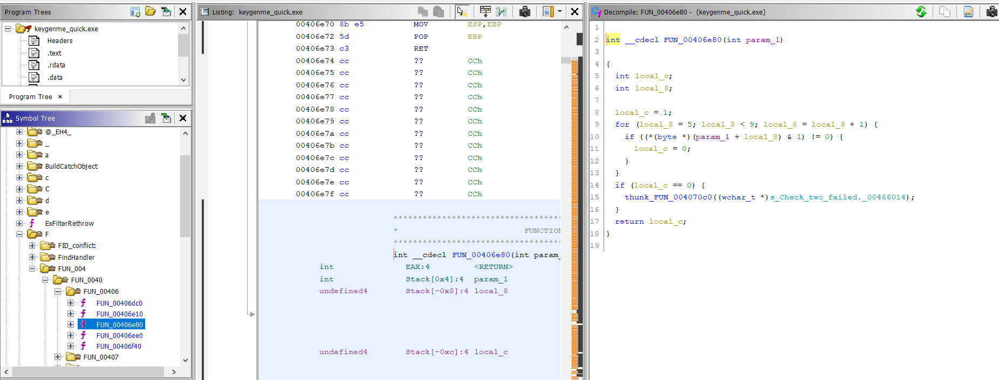
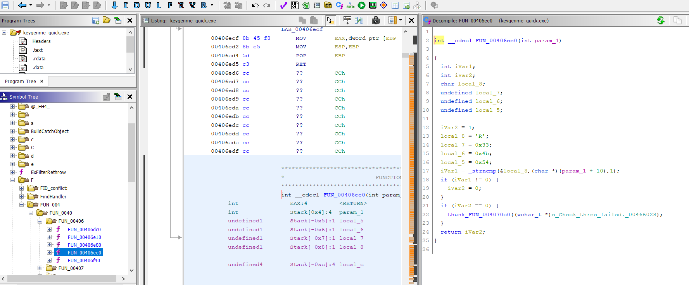

# Keygenme_quick!

An EXE file was given which took a code. We need to reverse that serial code. The first few characters of the code were provided.

## Solution
- Open the file in `ghidra`.

- The initials where given; `1096-xxxx-xxxx`

- Checking the symbol table, this is the function for check one;

- Since, the initials of flag are given, we'll just igrore this function.

- Next, the following function is for check two:

- In the decompile window, we can see that the center four characters are being logical `and`'ed with 1 and checked if the answer is 0 or not. Hence, we can say that the centre four characters are `0000`.
Current key status: `1096-0000-xxxx`.

- Now, the following function is for check three:

- As we can see, there is a `strncmp` function with `local_8` array. Hence, we simply decode the following variables which are in hexadecimal; `local_7`, `local_6` and `local_5`.

- Finally, the completed key is `1096-0000-R3KT`.

> Flag: vishwaCTF{1096-0000-R3KT}

